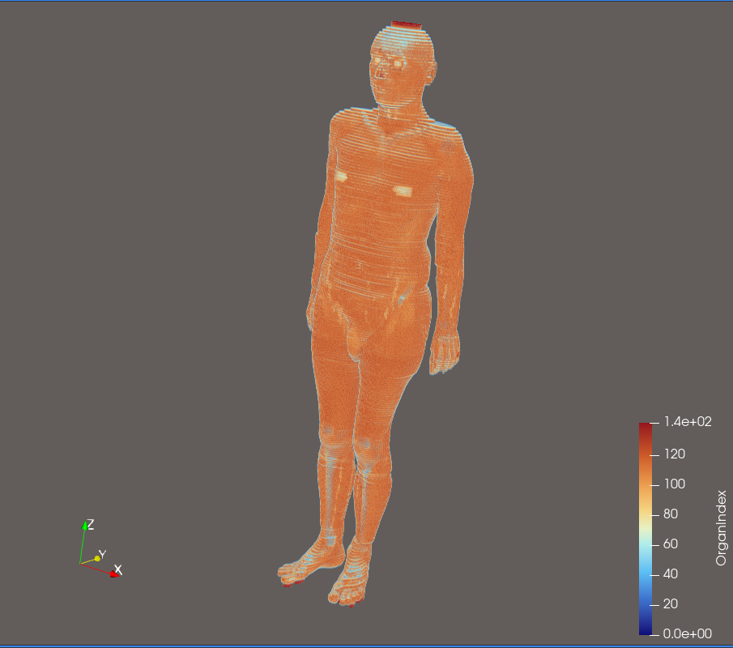

# ICRP 110 Voxel Phantom Visualization

Converts ICRP Publication 110 voxel phantom slice data (`.g4dat`) 
to VTK ImageData format (`.vti`) for 3D visualization in ParaView.

## Preview


## Features
- Parses ICRP 110 Adult Male (AM) slice files (`.g4dat`)
- Reconstructs full 3D voxel volume (254 × 127 × NZ)
- Preserves organ index mapping (up to 255 organs)
- Outputs `.vti` file directly loadable in ParaView

## Requirements
- Python 3.x
- NumPy
- ParaView (for visualization)

## Usage
```bash
python slices_to_vti.py <slice_folder> [output.vti]

# Example
python slices_to_vti.py AM phantom.vti
```

## Voxel Specifications (ICRP 110 AM)
| Parameter | Value |
|-----------|-------|
| Voxel size X | 2.137 mm |
| Voxel size Y | 2.137 mm |
| Voxel size Z | 8.0 mm |
| Grid size | 254 × 127 |

## Reference
- ICRP Publication 110 (2009)
